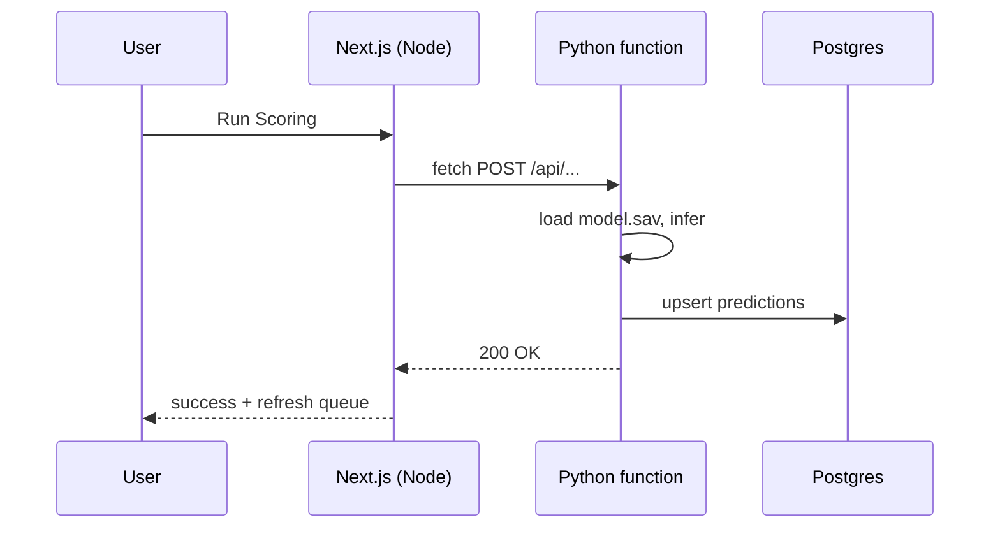

# ML scoring on Vercel (Next.js + Python)

This document explains how **machine learning inference** can run on **Vercel** alongside this repo’s **Next.js** app: what works, what does not, and which **project settings** matter.

## Mental model: one deployment, two runtimes

Vercel can host **more than one kind of serverless function** in the **same project**:

| Part | Runtime | Role |
|------|---------|------|
| Next.js (App Router, Server Actions, most `app/` code) | **Node.js** | Pages, UI, calling APIs |
| HTTP handlers you add under Vercel’s Python layout (e.g. `api/`) | **Python** | Load `model.sav`, use pandas/sklearn, talk to Postgres |

You do **not** need a second Vercel account or a separate “Python-only” deployment for this pattern. You add **Python functions** to the **same** project; they share the same domain and can use the **same environment variables** (for example `DATABASE_URL`).

Each **request** is handled by **one** function: either Node or Python. They are separate **serverless functions** (separate cold starts, memory, and time limits), not one long-lived server.

## Why `exec("python …")` from a Server Action fails

The scoring button previously used **Node** `child_process.exec` to run `python` or `python3` on the shell.

- Server Actions run in the **Node** runtime.
- That runtime does **not** include a `python` binary on the path the way your laptop does.
- So you see: `python: command not found` / `python3: command not found`.

That failure is **not** “Vercel forbids Python.” It is “this code path never used Vercel’s **Python runtime**; it assumed a generic shell with Python installed.”

## The pattern that matches Vercel

1. Implement scoring as a **Python Serverless Function** (Vercel discovers entrypoints under conventions such as `api/` — see [Vercel Python runtime](https://vercel.com/docs/functions/runtimes/python)).
2. Declare dependencies with **`requirements.txt`** (or `pyproject.toml` / lockfiles) in the **deploy root**.
3. From Next.js, **do not** shell out. Call the Python route with **`fetch()`** from a Server Action or Route Handler (same origin, or full URL).
4. After a successful response, **refresh data** the same way you would for any DB update: e.g. `revalidatePath('/warehouse/priority')` or client `router.refresh()`.

## Monorepo: `web/` as Root Directory

This repository keeps the Next app under **`web/`**.

In Vercel:

**Settings → General → Root Directory** should be **`web`** so the Next.js build runs in the right folder.

Implications:

- Python entrypoints and **`requirements.txt`** should live **under `web/`** (the deploy root), not only at the repo root, unless you change the project layout.
- If Root Directory is empty but the app only exists under `web/`, builds and file paths often do not match what you expect.

## Vercel settings checklist

| Setting | Typical action |
|--------|----------------|
| **Root Directory** | `web` if Next lives in `web/` |
| **Environment variables** | `DATABASE_URL`, secrets for auth between Next and Python (e.g. shared bearer token), any model paths |
| **Function max duration** | Increase if inference approaches time limits (depends on plan) |
| **Python version** | Pin with `.python-version` or `pyproject.toml` under the deploy root |

There is no separate “enable Python” toggle; Vercel detects Python from the **files** and dependency manifests in the deployment.

## `model.sav` and dependencies

- **`model.sav`** is usually **pickle/joblib** from scikit-learn. It is intended for **Python** inference, not for Node.
- On Vercel, the **Python function** can load `model.sav` **if** the file is **included in the deployment** (next to the function or copied at build) or loaded from **Blob / object storage** with a URL.
- **pandas**, **numpy**, and **scikit-learn** are large. Serverless deployments have **size limits**; builds can fail if the bundle is too big. If that happens, common mitigations are: trim dependencies, use lighter inference paths, or export the model to **ONNX** / **JSON coefficients** and run a smaller stack.

## Honest limitations

- **Cold starts**: the first request after idle can be slow, especially with heavy imports.
- **Timeouts**: scoring must finish within your plan’s **maximum duration** per invocation.
- **Not a substitute for a big batch training job**: train offline or elsewhere; the function should focus on **batch or single inference** that fits serverless limits.

## Alternatives (same product goals)

If Python on Vercel proves too tight for sklearn + pandas:

- **GitHub Actions** runs Python with your repo; trigger via API from Next and accept **async** scoring + refresh.
- **Small external API** (Railway, Render, Fly.io, Cloud Run) that runs the same script; Next calls it with `fetch`.
- **Export model** (coefficients JSON, ONNX) and run **inference in Node** so the edge stays thin.

## Summary

- Vercel **does** support **Python** as first-class serverless functions.
- Your Next app stays **Node**; scoring moves to a **Python HTTP handler** in the **same** project, invoked with **`fetch`**, not `exec`.
- Set **Root Directory** to **`web`** for this repo layout, keep Python artifacts **under that root**, and validate **build size and timeouts** on the first real deploy.
